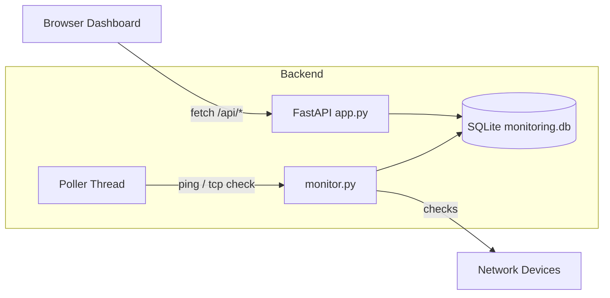
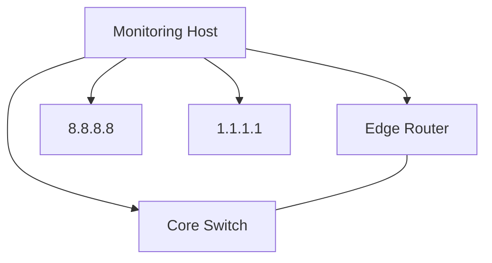

# Network Monitoring Dashboard

A lightweight network availability monitor built with Python and FastAPI. It periodically checks a list of devices (ICMP ping, with a TCP fallback for hosts where ICMP is filtered), stores the results in SQLite, and serves a small live dashboard with status cards, an uptime summary, and a latency history chart.

## Overview

This is a personal networking/automation lab project built to practice the kind of monitoring logic used in real NOC/network operations tooling: periodic polling, availability history, and a simple web view of device health.

## Problem

Network teams need a quick way to see which devices are up, track latency over time, and spot flapping links, without standing up a full commercial NMS. This project implements a minimal version of that workflow.

## Features

- Configurable device inventory (devices.yaml): name, IP, type, and check method
- ICMP ping checks with automatic TCP fallback (port 443 by default) for devices or firewalls that block ICMP
- Background polling thread (default: every 30s) independent of dashboard requests
- SQLite-backed history per device
- REST API for current status, per-device history, and an uptime/latency summary
- Static single-page dashboard (vanilla JS + Chart.js) with auto-refresh

## Architecture



## Technologies

Python 3.10+, FastAPI, Uvicorn, SQLite3, PyYAML, vanilla JavaScript, Chart.js.

## Network Topology (example lab)



## Installation

```bash
git clone https://github.com/JeevaNN-pan/network-monitoring-dashboard.git
cd network-monitoring-dashboard
python -m venv venv
source venv/bin/activate   # venv\\Scripts\\activate on Windows
pip install -r requirements.txt
```

## Configuration

Edit devices.yaml to point at your own devices. It works out of the box against public resolvers (8.8.8.8, 1.1.1.1) so you can see it running before pointing it at lab gear (GNS3, EVE-NG, Cisco Packet Tracer, or ContainerLab).

```yaml
devices:
  - name: lab-edge-router
    ip: 192.168.1.254
    type: router
    check: "tcp:22"   # use tcp:<port> when ICMP is filtered
```

## Usage

```bash
python app.py
# or: uvicorn app:app --reload
```

Open http://localhost:8000 in a browser for the dashboard, or query the API directly:

```bash
curl http://localhost:8000/api/status
curl http://localhost:8000/api/summary
curl http://localhost:8000/api/history/google-dns
```

## Example Output

```json
[
  {"name": "google-dns", "ip": "8.8.8.8", "device_type": "external-resolver", "is_up": 1, "latency_ms": 14.2, "checked_at": "2026-08-13T10:15:02"},
  {"name": "lab-edge-router", "ip": "192.168.1.254", "device_type": "router", "is_up": 0, "latency_ms": null, "checked_at": "2026-08-13T10:15:02"}
]
```

## Testing

```bash
pip install pytest
pytest tests/
```

Tests mock socket calls so they run without any real network access.

## Project Structure

```
network-monitoring-dashboard/
├── app.py              # FastAPI app + background poller
├── monitor.py          # Ping / TCP availability checks
├── database.py         # SQLite storage helpers
├── devices.yaml        # Device inventory
├── requirements.txt
├── index.html          # Dashboard UI
├── tests/
│   └── test_monitor.py
└── README.md
```

## Future Improvements

- SNMP polling for interface counters and CPU/memory on real network gear
- Email/webhook alerting on state change
- Multi-user auth for the dashboard
- Swap SQLite for a time-series store (InfluxDB/Prometheus) at larger scale

## Limitations

- ICMP ping relies on the OS ping binary being available and unrestricted; some environments (containers, certain cloud egress rules) may block it, which is why the TCP fallback exists
- Polling interval and history are process-local (in-memory thread + local SQLite file), not designed for multi-instance deployment
- No authentication on the API or dashboard, intended for local/lab use, not public exposure

## Disclaimer

Personal learning/portfolio project built to practice network automation and monitoring concepts. Not a production monitoring system and not affiliated with or tested against production infrastructure.
